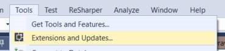
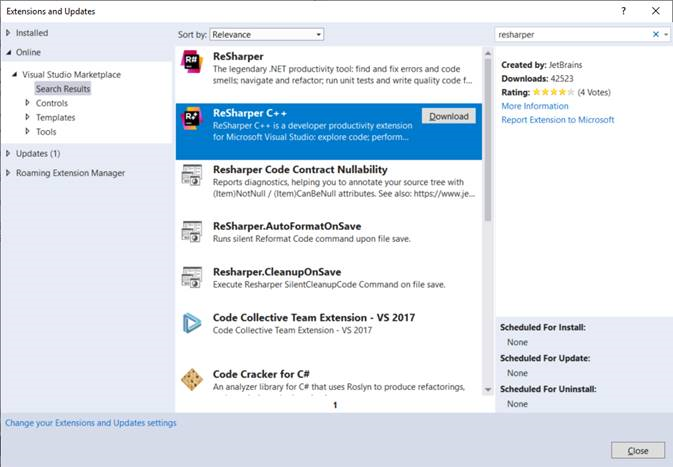
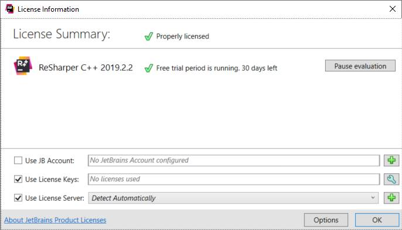

This is the C++ version of Smelly Shapes that belong to the [Clean Code Course](https://github.com/zuehlke/clean-code-workshop) by Zühlke

## Building and executing tests

### CLion

Successfully tested with versions:

- 2020-2022

### Visual Studio 2017/2019

See the [Visual Studio installer configuration](./.vsconfig). 

This list of packages is the default plus packages that are required to build and execute the Google test project without the need to change any project properties.

#### ReSharper C++

When using Visual Studio, it is recommended to use the ReSharper C++ extension during the course. Make sure that the extension is installed and ready-to-use on the participants' computers.

There is a trial period available so there is no need to buy the extension just for the course only.

## References

C# Version here
https://github.com/zuehlke/clean-code-workshop-csharp

Java version here
https://github.com/Zuehlke/clean-code-workshop/tree/master/smelly-shapes-java
